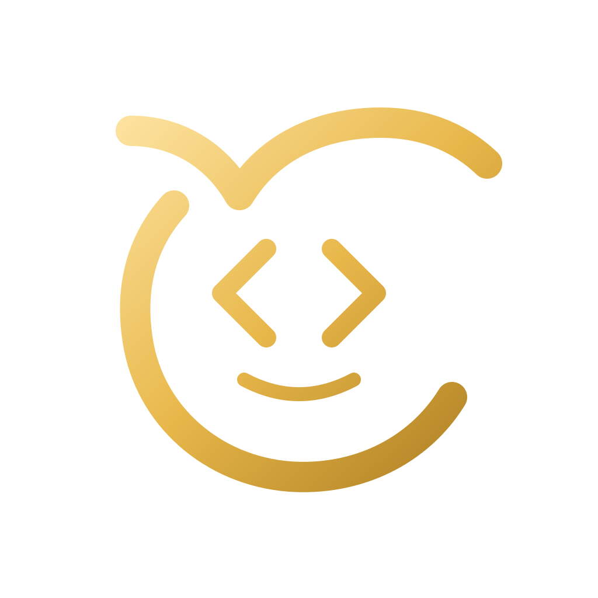

# Claude CN - Docker 镜像

<p align="center">
  
</p>

<div align="center">

[](https://hub.docker.com/r/host1syan/claude-cn)
[](#中文版)
[](#english-version)

</div>

---

## 中文版

### 项目简介

Claude CN 是一个重新构建的 **Claude 智能体工作台**的 Docker 镜像，把桌面端工作台封装为 **Web 可访问的服务**。运行容器后，直接用浏览器即可使用图形化界面，无需在宿主机安装 Bun、Node.js 等任何依赖。

镜像集成了 Nginx、PHP 7.4 环境和可选的 WebDAV 文件管理，适合个人或团队快速部署，也可一键发布到 Hugging Face Spaces。

**镜像特点：**
- 🐳 **开箱即用**：无需安装 Bun、Node.js 等依赖，直接运行
- 🌐 **Web 界面**：通过浏览器访问图形化工作台
- 📁 **WebDAV 支持**：可远程挂载和管理文件
- 🐘 **PHP 环境**：内置 PHP 7.4，可运行 PHP 脚本
- 🔒 **安全隔离**：容器化运行，不影响宿主系统
- 📱 **H5 远程访问**：支持手机或其他设备接入

### 快速开始

#### 1. 拉取镜像

```bash
docker pull host1syan/claude-cn
```

#### 2. 运行容器

以下三个环境变量**建议设置**，用于 Web 界面登录令牌和 WebDAV 账号：

```bash
docker run -d \
  --name claude-cn \
  -p 3456:3456 \
  -e CLAUDE_H5_TOKEN=你的访问令牌 \
  -e WEBDAV_USER=admin \
  -e WEBDAV_PASSWORD=你的密码 \
  -v claude-data:/data \
  host1syan/claude-cn
```

#### 3. 访问界面

打开浏览器访问 `http://localhost:3456`，输入 `CLAUDE_H5_TOKEN` 对应的令牌登录。

> `WEBDAV_USER` 和 `WEBDAV_PASSWORD` 同时设置后才启用 WebDAV；不需要 WebDAV 时可省略两个变量。建议挂载 `/data` 到卷或宿主机目录，避免容器重建后丢失数据。

### 环境变量配置

| 变量名 | 说明 |
|--------|------|
| `CLAUDE_H5_TOKEN` | Web 界面登录令牌（H5 远程访问） |
| `WEBDAV_USER` / `WEBDAV_PASSWORD` | WebDAV 账号密码，同时设置后启用 |
| `ANTHROPIC_AUTH_TOKEN` | API 认证令牌 |
| `ANTHROPIC_BASE_URL` | Anthropic 兼容网关地址 |
| `ANTHROPIC_MODEL` | 默认模型 |
| `ANTHROPIC_DEFAULT_SONNET_MODEL` / `ANTHROPIC_DEFAULT_HAIKU_MODEL` / `ANTHROPIC_DEFAULT_OPUS_MODEL` | Sonnet / Haiku / Opus 级别模型映射 |
| `API_TIMEOUT_MS` | API 超时时间（毫秒），默认 `3000000` |
| `CLAUDE_CONFIG_DIR` | 配置、会话、Skills、插件目录，容器默认 `/data/.claude` |
| `DISABLE_TELEMETRY` | 设为 `1` 禁用遥测 |
| `CLAUDE_CODE_DISABLE_NONESSENTIAL_TRAFFIC` | 设为 `1` 禁用非必要网络请求 |

### 功能说明

#### 🌐 Web 界面

通过浏览器即可完成会话管理、多项目切换、代码编辑与 Diff 查看、权限审批等桌面端核心操作。

#### 📁 WebDAV 文件管理

设置 `WEBDAV_USER` / `WEBDAV_PASSWORD` 后即可挂载：

- 访问地址：`http://localhost:3456/webdav/`
- **macOS**：Finder → 前往 → 连接服务器
- **Windows**：文件资源管理器 → 映射网络驱动器
- **Linux**：`davfs2` 或 `rclone`

#### 🐘 PHP 环境

内置 PHP 7.4，可运行 PHP 脚本（文件放在 `/data/php/`，访问 `/php/` 路由）。

#### 📱 H5 远程访问

在设备浏览器访问 `http://你的服务器地址:3456`，输入令牌即可从手机或其他设备接入会话。

### 数据持久化

所有配置、会话、Skills、插件和 PHP 文件存放在 `/data/`。建议挂载卷或宿主目录：

```bash
# 使用 Docker 卷
-v claude-data:/data
# 或本地目录
-v /path/to/local/data:/data
```

### 访问模型（常见组合）

| 场景 | 变量配置 |
|------|----------|
| Anthropic 官方 | `ANTHROPIC_BASE_URL=https://api.anthropic.com` + `ANTHROPIC_AUTH_TOKEN` |
| OpenAI 兼容 | 通过 LiteLLM 等代理转换协议，`ANTHROPIC_BASE_URL=http://代理地址:4000` |
| DeepSeek | 通过协议转换代理，`ANTHROPIC_MODEL=deepseek-chat` |

### 常见问题

#### 无法访问 Web 界面

```bash
docker ps | grep claude-cn     # 容器是否运行
netstat -tlnp | grep 3456      # 端口是否被占用
docker logs claude-cn          # 查看日志
```

#### 令牌登录失败

- 确认 `CLAUDE_H5_TOKEN` 已设置
- 若持久化目录存在旧配置，删除后重启容器会重新生成

#### WebDAV 连接失败

```bash
docker exec claude-cn env | grep WEBDAV   # 确认变量已设置
curl -u admin:你的密码 http://localhost:3456/webdav/
```

### 安全建议

1. **修改默认令牌**：不要使用弱令牌
2. **使用强密码**：WebDAV 密码应足够复杂
3. **限制访问**：仅在需要时暴露端口
4. **定期更新**：及时更新镜像获取安全补丁

### 许可证

以项目根目录 `LICENSE` 为准。

---

## English Version

### Project Overview

Claude CN is a Docker image that turns a Claude-style agent workbench into a **browser-accessible web service**. Run the container and open the graphical workspace in a browser — no Bun or Node.js needed on the host. The image bundles a web UI, PHP 7.4, and optional WebDAV file management, and works with Hugging Face Spaces.

**Image Features:**
- 🐳 **Ready to Use**: no Bun or Node.js required
- 🌐 **Web Interface**: access the workbench via browser
- 📁 **WebDAV Support**: remote file mounting and management
- 🐘 **PHP Environment**: built-in PHP 7.4
- 🔒 **Secure Isolation**: containerized, no host impact
- 📱 **H5 Access**: access from mobile or other devices

### Quick Start

```bash
docker pull host1syan/claude-cn

docker run -d \
  --name claude-cn \
  -p 3456:3456 \
  -e CLAUDE_H5_TOKEN=your_token \
  -e WEBDAV_USER=admin \
  -e WEBDAV_PASSWORD=your_password \
  -v claude-data:/data \
  host1syan/claude-cn
```

Open `http://localhost:3456` and sign in with `CLAUDE_H5_TOKEN`. WebDAV is enabled only when both `WEBDAV_USER` and `WEBDAV_PASSWORD` are set.

### Environment Variables

| Variable | Description |
|----------|-------------|
| `CLAUDE_H5_TOKEN` | Web UI login token |
| `WEBDAV_USER` / `WEBDAV_PASSWORD` | WebDAV credentials; enabled when both are set |
| `ANTHROPIC_AUTH_TOKEN` | API authentication token |
| `ANTHROPIC_BASE_URL` | Anthropic-compatible gateway URL |
| `ANTHROPIC_MODEL` | Default model |
| `ANTHROPIC_DEFAULT_SONNET_/HAIKU_/OPUS_MODEL` | Per-tier model mapping |
| `API_TIMEOUT_MS` | API timeout (ms), default `3000000` |
| `CLAUDE_CONFIG_DIR` | Config, sessions, and Skills directory; `/data/.claude` by default |
| `DISABLE_TELEMETRY` | Set `1` to disable telemetry |
| `CLAUDE_CODE_DISABLE_NONESSENTIAL_TRAFFIC` | Set `1` to disable non-essential traffic |

### Persistence

Mount `/data/` to a Docker volume or host directory to preserve config, sessions, Skills, plugins, and PHP files across container replacement. For Hugging Face Spaces, persistent storage mounts at `/data/` automatically.

### License

See `LICENSE` in the repository root.