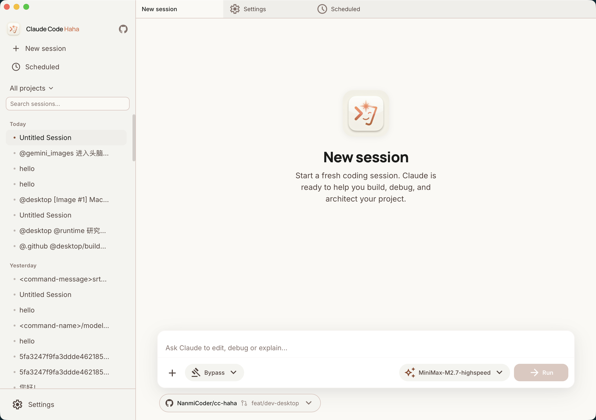
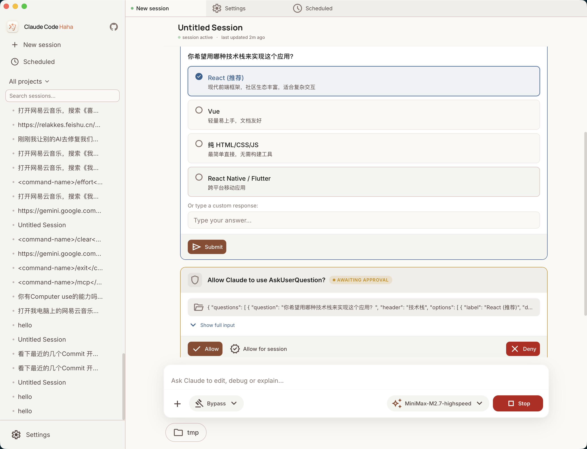
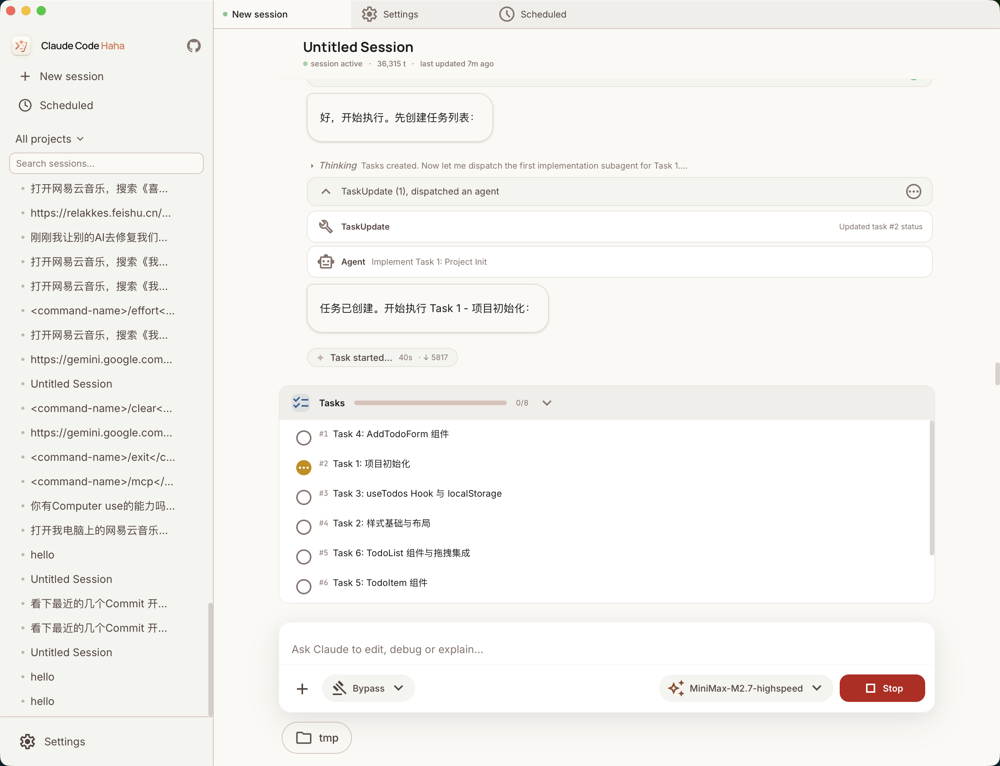
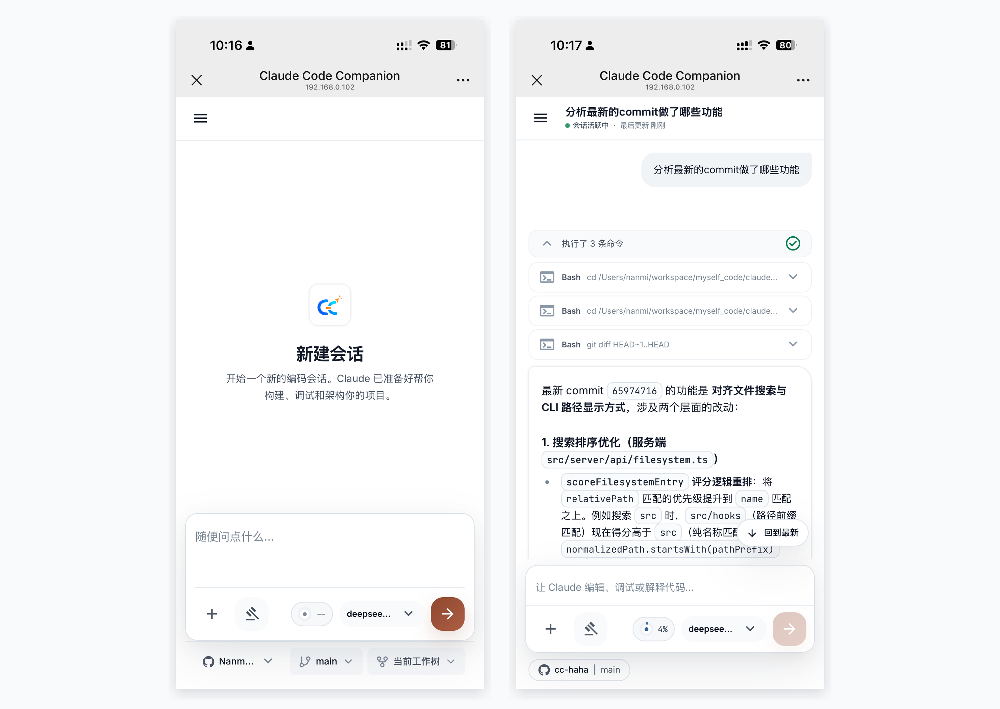
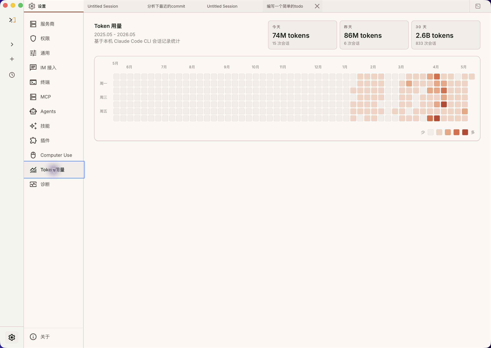

# ClaudeCN

<p align="center">
  
</p>

<div align="center">

[](https://github.com/host1syan/claude-cn/stargazers)
[](https://hub.docker.com/r/host1syan/claude-cn)
[](README.md)
[](README.en.md)

</div>

ClaudeCN is a Claude-style agent workbench built around **Chinese-first prompts**, running on macOS, Windows, and Linux. Multi-session management, projects, branch and Worktree isolation, code diffs, permission review, multiple model providers, Computer Use, H5 remote access, IM adapters, and scheduled tasks live in one workspace, available through a terminal CLI, a local server, and a desktop app.

Chinese-first prompts reduce language switching in Chinese development workflows. Actual token usage depends on model, task complexity, and context. Model, upstream gateway, and platform policies still apply.

## Quick Start

1. Download the installer for your platform from [GitHub Releases](https://github.com/host1syan/claude-cn/releases), or deploy the [Docker image](DOCKER_README.md).
2. Configure your provider, API key, and default model in Settings on first launch.
3. Create a session, pick a working directory, and start chatting.

Temporary macOS builds may require manual approval; unsigned Windows installers may trigger SmartScreen. See the [Installation Guide](docs/desktop/04-installation.md).

## Highlights

- **Chinese-first agent workflow**: core task-management, verification-agent, and tool prompts use Chinese.
- **Built-in free providers**: Claude CN and Kilo Free provider configurations with free-model routing available in current builds.
- **Multi-session workbench**: tabs, project switching, session history, terminals, and background tasks.
- **Branch and Worktree isolation**: start sessions on a selected branch in the current tree or an isolated Worktree.
- **Visual code review**: inspect edits, changed files, line counts, diffs, and workspace state.
- **Permission workflow**: review risky commands, tool calls, and model questions in the desktop app.
- **Multiple model providers**: Anthropic-compatible APIs, third-party models, protocol proxies, and local models.
- **Memory and multi-agent systems**: persistent memory, agent orchestration, parallel tasks, Teams, and Skills.
- **Computer Use**: authorized screenshots, clicks, typing, and desktop-app control.
- **H5 and IM access**: remote sessions through browser, Telegram, Feishu, WeChat, and DingTalk.
- **Scheduled tasks and usage statistics**: plan work and inspect token trends.

## Screenshots

| | |
|------|------|
|  |  |
|  |  |
|  |  |

## Documentation

| Document | Description |
|------|------|
| [Quick Start](docs/guide/quick-start.md) | Install, launch, and choose a provider |
| [Third-Party Models](docs/guide/third-party-models.md) | Anthropic-compatible APIs, LiteLLM, DeepSeek, and built-in free models |
| [Environment Variables](docs/guide/env-vars.md) | Environment-variable reference |
| [Desktop App](docs/desktop/index.md) | Installation, layout, features, H5 access |
| [Memory System](docs/memory/) | Cross-session persistent memory |
| [Multi-Agent System](docs/agent/) | Agent orchestration, parallel tasks, and Teams |
| [Skills System](docs/skills/) | Extensible capabilities and custom workflows |
| [IM Access](docs/im/) | Remote conversation and management |
| [Computer Use](docs/features/computer-use.md) | Screenshot, mouse, and keyboard control |
| [Docker Deployment](DOCKER_README.md) | Browser-based Docker deployment |
| [FAQ](docs/guide/faq.md) | Common troubleshooting |

## Docker Deployment

Docker Hub image: [`host1syan/claude-cn`](https://hub.docker.com/r/host1syan/claude-cn). Run the container and access the web UI in a browser — no Bun or Node.js needed on the host.

```bash
docker pull host1syan/claude-cn

docker run -d \
  --name claude-cn \
  -p 3456:3456 \
  -e CLAUDE_H5_TOKEN=your_secret_token \
  -e WEBDAV_USER=admin \
  -e WEBDAV_PASSWORD=your_webdav_password \
  -v claude-data:/data \
  host1syan/claude-cn
```

Open `http://localhost:3456` and sign in with `CLAUDE_H5_TOKEN`. See [Docker Usage](docker/USAGE.md) and [Docker Image Guide](DOCKER_README.md).

## Disclaimer

This project is provided for learning and research only. Free providers, third-party models, and upstream services follow their own terms; users are responsible for usage, data security, and compliance. Original Claude Code source copyrights belong to their respective owners.