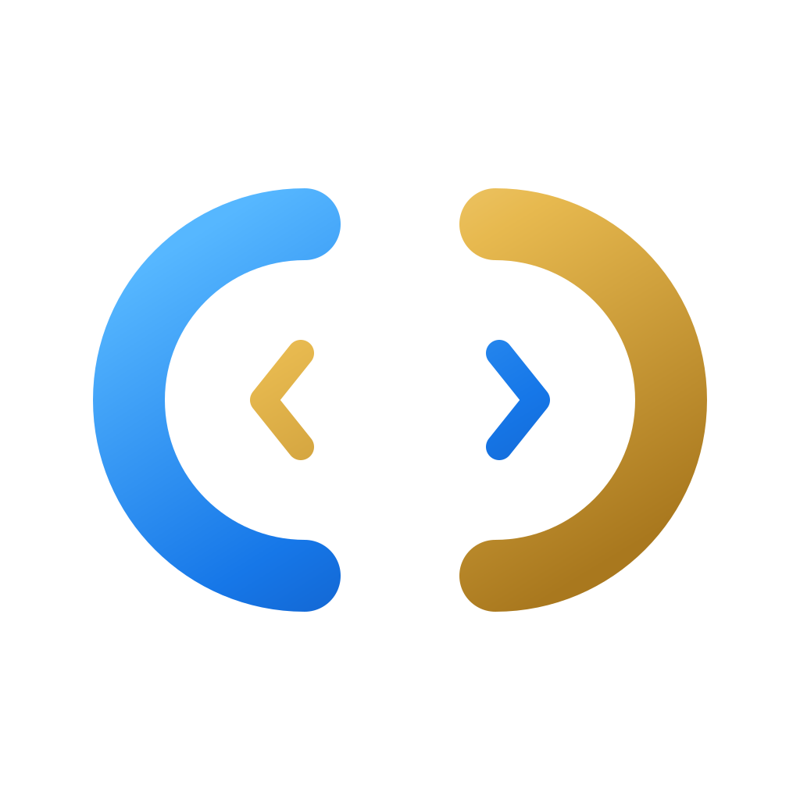

# Claude Code Cn

<p align="center">
  
</p>

<div align="center">

[](https://github.com/host1syan/claude-cn/stargazers)
[](https://github.com/host1syan/claude-cn/network/members)
[](https://github.com/host1syan/claude-cn/issues)
[](https://github.com/host1syan/claude-cn/blob/main/LICENSE)
[](README.md)
[](README.en.md)

</div>

ClaudeCN 是一套全中文提示词为主的仿 Claude 智能体工作台，支持 macOS、Windows、Linux。项目同时提供终端 CLI、本地服务端和桌面端，把多会话、多项目、分支与 Worktree 隔离、代码 Diff、权限审批、模型渠道、Computer Use、H5 远程访问、IM 接入和定时任务集中到一个工作台。

中文提示词减少中英切换，适合中文开发和长任务工作流。实际 Token 消耗取决于模型、任务复杂度和上下文内容；模型、上游网关及平台自身策略仍然有效。

## 核心亮点

- **全中文 Agent 工作流**：核心任务管理、验证 Agent 和工具提示词采用中文，面向中文开发场景优化。
- **Claude CN 免费渠道**：内置 Claude CN 渠道配置，可直接使用当前版本提供的免费模型路由。
- **Kilo Free 免费渠道**：内置 Kilo Free 渠道，默认提供 `stepfun/step-3.7-flash:free` 等免费模型选择。
- **缓存命中支持**：支持 Anthropic Prompt Cache 相关协议和缓存用量字段，长任务中的稳定上下文可以复用服务端缓存。
- **RTK 与 Caveman 方向**：工具输出压缩和模型输出压缩是项目的压缩方向；是否启用取决于当前构建版本和运行配置，不把未确认能力当作固定保证。
- **多会话工作台**：标签页、项目切换、会话历史、终端入口和后台任务集中管理。
- **分支与 Worktree 隔离**：新会话可选择仓库分支，并决定使用当前工作树或隔离 Worktree。
- **代码改动可视化**：查看 AI 文件修改、增删行、Diff 和工作区状态。
- **权限与确认流**：危险命令、工具调用和模型反问在桌面端集中审批。
- **多模型渠道**：支持 Anthropic 兼容 API、第三方模型、协议转换代理和本地模型。
- **Memory 与多 Agent**：跨会话持久化记忆、Agent 编排、并行任务、Teams 协作和 Skills 扩展。
- **Computer Use**：授权后截图、点击、输入并控制桌面应用。
- **H5 与 IM 接入**：从手机或其他设备访问会话，也可通过 Telegram、飞书、微信、钉钉等渠道远程对话和审批。
- **定时任务与用量统计**：创建计划任务，查看本机 Token 使用趋势。

## 渠道和缓存说明

Claude CN 与 Kilo Free 都依赖上游服务。免费模型目录、额度、限流、响应速度和服务可用性可能变化，项目不承诺永久免费、无限额度或固定可用率。详细配置见[第三方模型文档](docs/guide/third-party-models.md)。

项目支持 Prompt Cache 协议字段，并可映射 `cache_read_input_tokens`、`cache_creation_input_tokens` 等缓存用量。长任务中，稳定的系统提示词、工具列表和请求前缀更容易复用缓存；实际命中率受上游模型、缓存 TTL、请求结构和上下文变化影响，不承诺固定百分比。

工具输出压缩（RTK）和模型输出压缩（Caveman）属于项目压缩方向。使用前请以当前版本设置页、构建产物和实际运行结果为准。

## 安装桌面端

1. 前往 [Releases](https://github.com/host1syan/claude-cn/releases) 下载 macOS、Windows 或 Linux 安装包。
2. 首次启动后，在桌面端设置中配置模型渠道、API Key 和默认模型。
3. macOS 临时包可能需要手动放行；Windows 未签名安装包可能触发 SmartScreen。详见[桌面端安装指南](docs/desktop/04-installation.md)。

## 从源码启动

```bash
bun install
cp .env.example .env

# 启动终端 CLI
./bin/claude-cn

# 启动本地服务端，默认 3456 端口
SERVER_PORT=3456 bun run src/server/index.ts

# 启动桌面端
cd desktop && bun install && bun run dev
```

配置方式见[环境变量](docs/guide/env-vars.md)、[全局使用](docs/guide/global-usage.md)和[快速开始](docs/guide/quick-start.md)。

## 更多文档

| 文档 | 说明 |
|------|------|
| [快速开始](docs/guide/quick-start.md) | 安装、启动和渠道选择 |
| [环境变量](docs/guide/env-vars.md) | 完整环境变量参考 |
| [第三方模型](docs/guide/third-party-models.md) | 配置 Anthropic、OpenAI、DeepSeek、Ollama 和内置免费渠道 |
| [记忆系统](docs/memory/01-usage-guide.md) | 跨会话持久化记忆 |
| [多 Agent 系统](docs/agent/01-usage-guide.md) | Agent 编排、并行任务和 Teams 协作 |
| [Skills 系统](docs/skills/01-usage-guide.md) | 可扩展能力插件和自定义工作流 |
| [IM 接入](docs/im/) | 远程对话、项目切换和权限审批 |
| [Computer Use](docs/features/computer-use.md) | 截屏、鼠标和键盘控制 |
| [桌面端](docs/desktop/) | 图形化客户端、H5 和安装构建 |
| [常见问题](docs/guide/faq.md) | 常见错误排查 |
| [项目结构](docs/reference/project-structure.md) | 代码目录说明 |

## 技术栈

| 类别 | 技术 |
|------|------|
| 语言 | TypeScript |
| 桌面壳层 | Electron，sidecar 单二进制共享运行时 |
| 桌面界面 | React、Vite、Tailwind CSS |
| 状态管理 | Zustand |
| 本地运行时 | [Bun](https://bun.sh) |
| 终端界面 | React、Ink |
| CLI 解析 | Commander.js |
| 接口 | Anthropic SDK |
| 协议 | MCP、LSP |
| IM 适配器 | Telegram、飞书、微信、钉钉 |

## Docker 部署

Docker Hub 镜像：[`host1syan/claude-cn`](https://hub.docker.com/r/host1syan/claude-cn)。镜像提供浏览器 Web 界面、H5 远程访问、Nginx、PHP 7.4 和可选 WebDAV 文件管理。无需在宿主机安装 Bun 或 Node.js。

### 拉取并运行

```bash
docker pull host1syan/claude-cn

docker run -d \
  --name claude-cn \
  -p 3456:3456 \
  -e CLAUDE_H5_TOKEN=your_secret_token \
  -e WEBDAV_USER=admin \
  -e WEBDAV_PASSWORD=your_webdav_password \
  -v claude-data:/data \
  host1syan/claude-cn
```

启动后打开 `http://localhost:3456`，输入 `CLAUDE_H5_TOKEN` 登录。`WEBDAV_USER` 和 `WEBDAV_PASSWORD` 同时设置后启用 WebDAV；不需要 WebDAV 时可以省略两个变量。

### Docker 配置

| 变量 | 说明 |
|------|------|
| `CLAUDE_H5_TOKEN` | H5 访问令牌和 Web 界面登录凭据 |
| `WEBDAV_USER` / `WEBDAV_PASSWORD` | WebDAV 账号密码，同时设置后启用 |
| `ANTHROPIC_AUTH_TOKEN` | API 认证令牌 |
| `ANTHROPIC_BASE_URL` | Anthropic 兼容网关地址 |
| `ANTHROPIC_MODEL` | 默认模型 |
| `CLAUDE_CONFIG_DIR` | 配置、会话、Skills 和插件目录；容器默认使用 `/data/.claude` |
| `API_TIMEOUT_MS` | API 超时时间，默认 `3000000` |

`/data/` 保存配置、会话、Skills、插件和 PHP 文件。建议挂载 Docker 卷或宿主机目录，避免容器重建后丢失数据。

完整说明见 [Docker 使用文档](docker/USAGE.md) 和 [Docker 镜像说明](DOCKER_README.md)，包括 WebDAV、PHP、Hugging Face Spaces、持久化和故障排查。

---

## 免责声明

本项目基于 Claude Code 源码重构，相关版权归原作者所有，仅供学习与研究使用。免费渠道、第三方模型和上游服务遵循各自服务条款；请用户自行确认使用场景、数据安全和合规要求。
